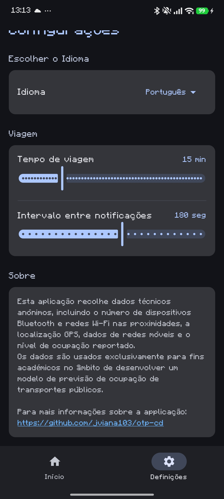
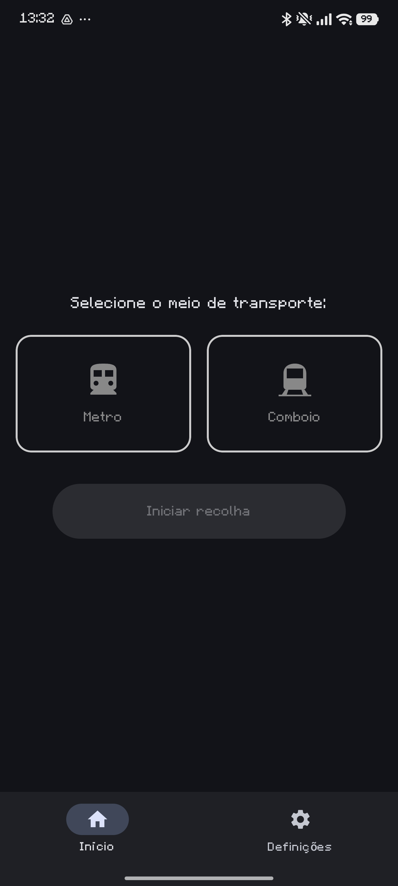
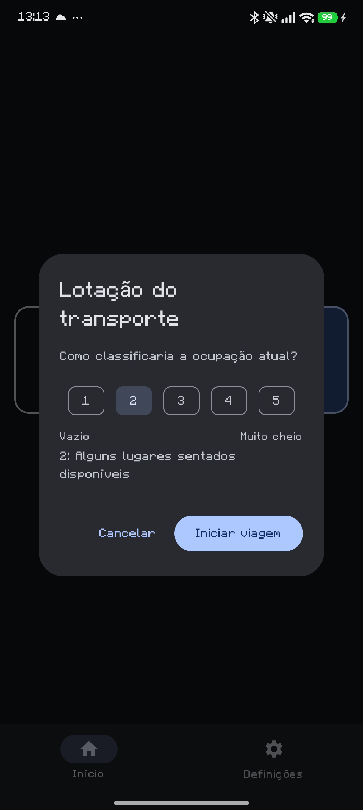
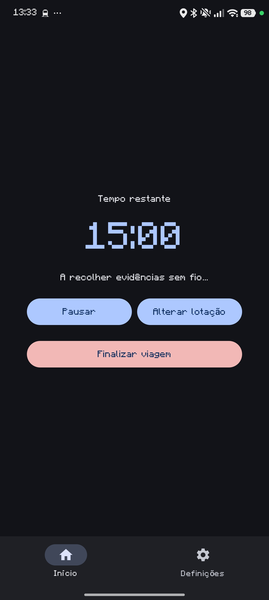
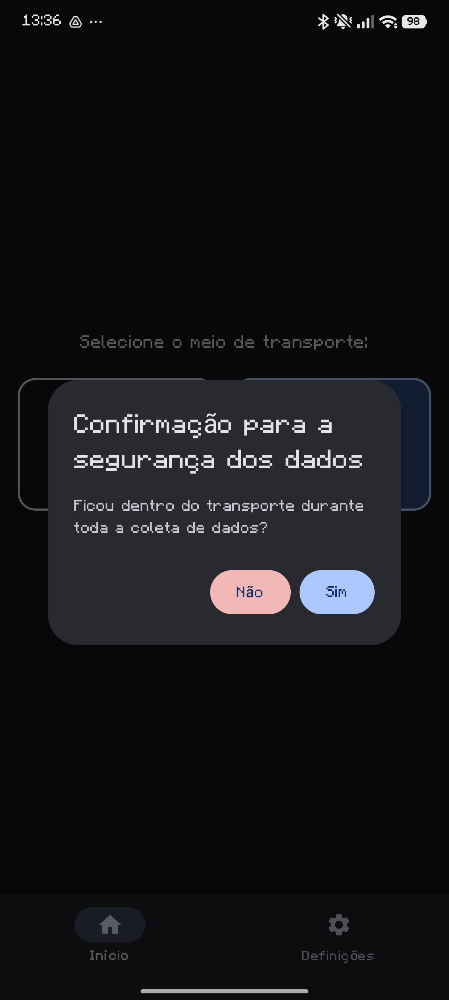

# otp-cd

## Informações

> **Aplicação de Coleta de Dados**
>
> Esta app recolhe dados técnicos incluindo o número de dispositivos Bluetooth e redes Wi-Fi nas proximidades, a localização GPS e o nível de ocupação reportado.
>
> Os dados são usados exclusivamente para fins académicos no âmbito de desenvolver um modelo de previsão de ocupação de transportes públicos.
> 
> **Todos os dados são completamente anónimos**
> 
> Apenas inicie a coleta de dados quando estiver dentro do transporte selecionado. Não se esqueça de terminar a viagem quando sair do transporte.
> 

## Instalação

> Faça o download do APK em https://github.com/jviana103/otp-cd/releases/download/public-release-1.0.1/otp-cd.apk e instale-o no seu dispositivo Android. Certifique-se de conceder as permissões necessárias para que a aplicação funcione corretamente.

## Utilização

> **1. Configurações:** Ajuste as suas preferências no menu de definições.
> 
> 
>
> **2. Seleção de Transporte:** No ecrã principal, selecione o meio de transporte. Atualmente, apenas é possível escolher entre Metro e Comboio.
>
> 
>
> **3. Iniciar Recolha:** Clique em iniciar recolha e classifique a lotação atual (de 1 a 5).
>
> 
>
> **4. Durante a Viagem:** Enquanto o tempo decorre, é possível pausar a recolha ou alterar a lotação diretamente no ecrã principal.
>
> 
>
> **5. Finalizar:** Ao terminar a viagem, será exibida a confirmação de segurança dos dados. É muito importante selecionar "Não" caso alguma leitura tenha sido feita fora do transporte/carruagem.
>
> 